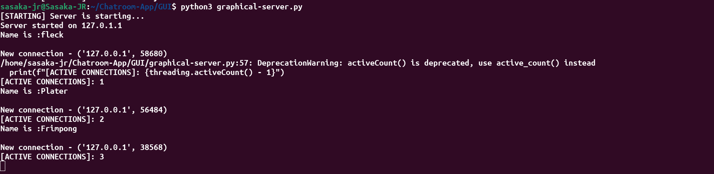

# Chatroom-App

Chatroom Application implemented using python3 and socket programming.

Go on invite your friends for a nice chat!

## Prerequisites

Ensure python3 is installed in your machine to run the command line implementation.

You can download Python from the official website [here](https://www.python.org/downloads/).

Tkinter for the GUI:

    sudo apt install python3-tk

More about Tkinter  [here](https://www.geeksforgeeks.org/python-gui-tkinter/).

## COMMAND_LINE IMPLEMENTATION

In many systems, using ports below `1024` requires superuser (sudo) privileges. This is a security feature to prevent non-privileged users from starting services that listen on well-known ports.

If you don't want to run the server with sudo privileges, you can use a port number greater than `1024`.Change the PORTS variable appropriately.

### Starting the server

    cd command-line
    run sudo python3 MyServer.py

    or alternatively from the root repository:
    run sudo python3 command-line/MyServer.py

### Clients

    cd command-line
    run  python3 MyClient.py

    or alternatively from the root repository:
    run python3 command-line/MyClient.py

    Different clients need different terminals.

`Client CC created.Messages sent`

`Client Noni created.Messages sent`

`Client Imposter created.Messages sent`

### Main server receiving messages

`Messages being received`

### Connections closed by clients

`Connections closed`

### Disclaimer

Host `0.0.0.0` will listen to all IP addresses.Listening on all interfaces could potentially expose your server to the internet (if it's connected), which could be a security risk if your server is not secured properly.

Always make sure to implement proper security measures when writing server software.

## GRAPHICAL USER INTERFACE IMPLEMENTATION

### Starting the graphical server

    cd GUI
    run  python3 graphical-server.py

    or alternatively from the root repository:
    run python3 GUI/graphical-server.py

### Graphical Chatroom

    cd GUI
    run  python3 graphical-server.py

    or alternatively from the root repository:
    run python3 GUI/graphical-server.py

    Requires more than one session in the room.

- A username is required for a chatroom session

- Chatroom

### Main server receiving connections

- The GUI can be done by different devices within the same network for ease in communication.

## Acknowledgements

- [Command-line-messaging](https://pythonprogramming.net/server-chatroom-sockets-tutorial-python-3/)
- [GeeksforGeeks](https://www.geeksforgeeks.org/gui-chat-application-using-tkinter-in-python/)
